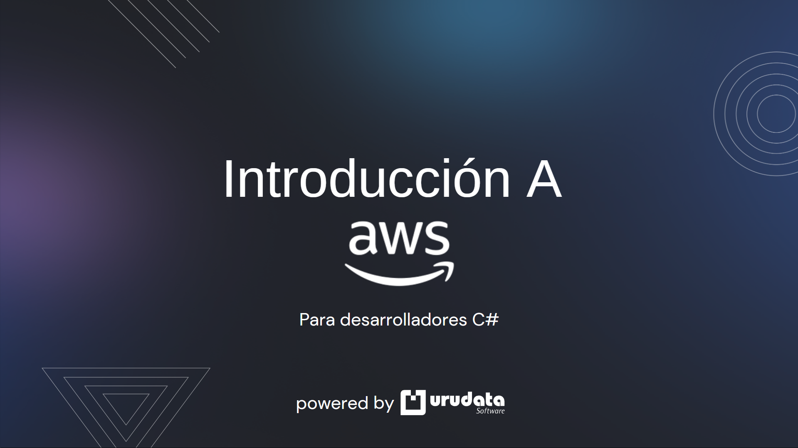

# AWS Tech Talk
Este repositorio contiene el codigo de muestra utilizado en la segunda edicion de Tech Talks organizado por Urudata Software en la que di una charla titulada "Introduccion a AWS para desarrolladores c#.

# Breve Descripcion
En la charla revisamos los siguientes servicios de AWS:
- SQS
- SNS
- DynamoDB
- S3
- Secrets Manager
- Lambda

Para los ejemplos se iba construyendo y mejorando una posible solucion a un problema basico en el que tenemos un sistema que da de alta un usuario en BD y envia distintos tipos de mensajes, imagenes, utiliza secretos de forma automatica y procesa automaticamente acciones mediante aws lambda.